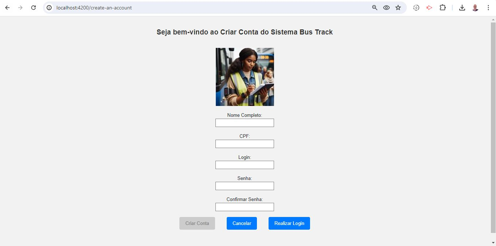
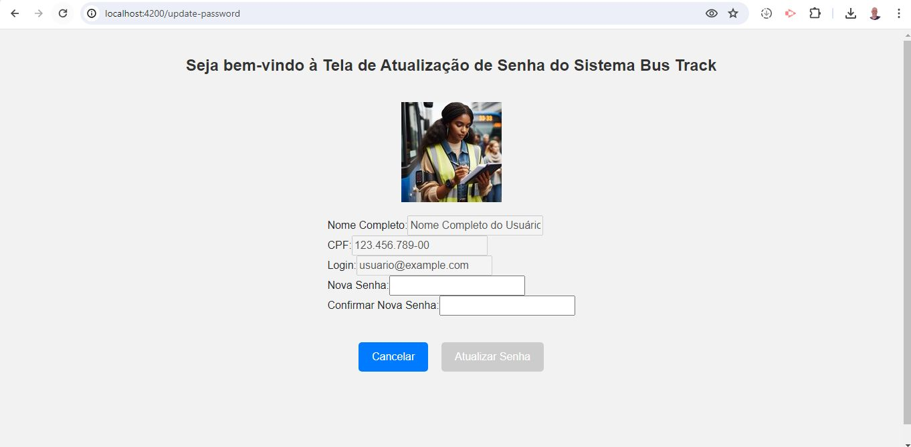
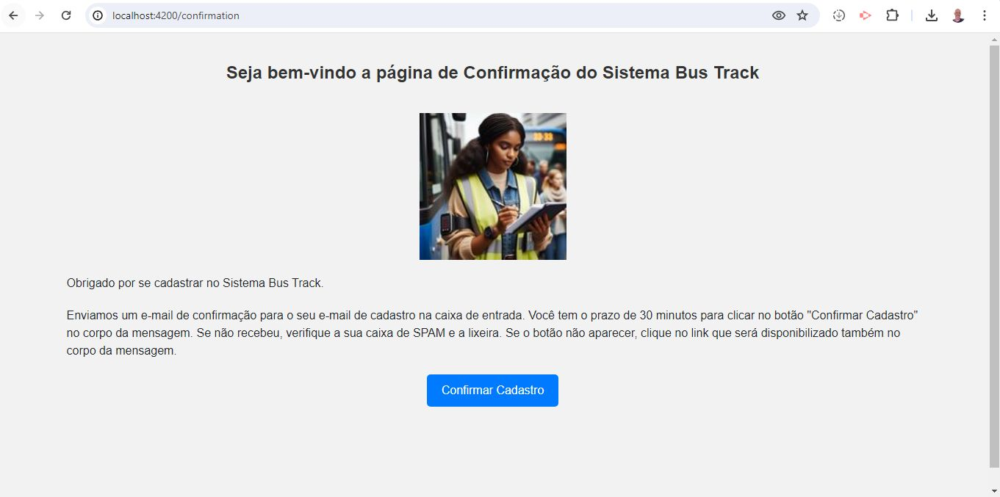
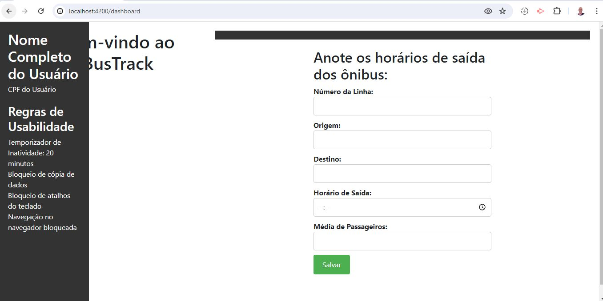

README

# Bus Track


O projeto Bus Track fornece uma API RESTful para gerenciar dados de ônibus. A API permite que os fiscais obtenham, criem, atualizem e excluam dados de ônibus.
O DB é o banco de dados NoSQL e o escolhido foi o MongoDB. O Front é o que o fiscal que é o usuário irá verificar e interagir com o sistema e o escolhido foi o Angular. Tem os testes que serão o unitário, integração, perfomance e usabilidade. O unitário para verificar pequenas partes do código se está saindo como o planejado e o de usabilidade para garantir que a interface do usuário seja intuitiva e fácil de usar.

## Funcionalidades Principais

O objetivo principal do projeto é realizar o controle tanto de quantos passageiros embarcaram durante aquela viagem sendo que há uma média e se ficar abaixo, sofrerá punição.

- Ônibus: Informações sobre os ônibus, como número, modelo, marca e capacidade.
- Motoristas: Informações sobre os motoristas, como nome, idade e licença de motorista.
- Rotas: Informações sobre as rotas, como origem, destino e número de paradas.
- Passageiros: Informações sobre os passageiros, como nome, idade e endereço.

## Ferramentas utilizadas

O projeto Bus Track é composto por um backend desenvolvido em C# com ASP.NET Core, um frontend desenvolvido com Angular, persistência de dados utilizando MongoDB e diferentes tipos de testes automatizados.

### Backend — `BusTrack.csproj`

* **C#**
* **.NET 10**
* **ASP.NET Core**
* **MongoDB**
* **AutoMapper** — mapeamento entre modelos e DTOs.
* **BCrypt.Net-Next** — hashing de senhas.
* **Newtonsoft.Json** — serialização e desserialização JSON.
* **Swashbuckle.AspNetCore** — documentação da API com Swagger.
* **System.Linq.Async** — operações LINQ assíncronas.
* **Selenium.WebDriver** — automação utilizada nos testes de usabilidade.
* **BenchmarkDotNet** — testes de performance.
* **Moq** — criação de mocks nos testes.

### Banco de dados

* **MongoDB**
* **MongoDB.Driver**
* **MongoDB.Bson**

### Frontend — `bustrack.frontend.client.esproj`

* **Angular**
* **TypeScript**
* **HTML**
* **CSS**

O frontend é responsável pela interface utilizada pelos usuários do sistema e pelas telas de autenticação, cadastro, dashboard, atualização de senha e registro das informações relacionadas às viagens.

### Frontend Server — `BusTrack.Frontend.Server.csproj`

Servidor ASP.NET Core responsável pela integração do frontend Angular com a aplicação.

* **C#**
* **.NET 10**
* **ASP.NET Core**
* **Microsoft.AspNetCore.SpaProxy**
* **MongoDB.Driver**
* **AutoMapper**
* **Newtonsoft.Json**
* **Swashbuckle.AspNetCore**
* **BenchmarkDotNet**
* **Selenium.WebDriver**
* **Moq**

### Testes — `BusTrack.Tests.csproj`

Projeto separado para os testes automatizados da aplicação.

* **xUnit** — estrutura dos testes.
* **Moq** — criação de mocks.
* **Microsoft.NET.Test.Sdk** — infraestrutura de execução dos testes.
* **coverlet.collector** — coleta de cobertura de testes.
* **Microsoft.AspNetCore.TestHost** — criação de servidores de teste para os testes de integração.
* **BenchmarkDotNet** — testes de performance.
* **Selenium.WebDriver** — testes de usabilidade.

### Configuração geral

Todos os projetos .NET da solução foram atualizados de **.NET 7 para .NET 10**.

Também estão habilitados:

* `ImplicitUsings`
* Nullable Reference Types

A solução utiliza o arquivo `BusTrack.sln` para organizar os projetos do backend, frontend server e testes.

### Segurança

No parte de backend utilizei o JWT para token e Bcrypt para hashing de senhas como pode verificar logo acima.

Já no frontend criei regras para não salvar senha, copiar informações tanto com o teclado quanto selecionando com o botão esquerdo do mouse, o botão direito está desativado em todo o sistema e tem um temporizador de conexão de 20 minutos. Além disso, não pode voltar ou avançar na tela do sistema com os botões do navegador. Também há a política de senha que o usuário, a cada 45 dias, é obrigado a trocar a senha e o aviso será mostrado quando estiver desconectado.


## Histórico de Atualizações

### 2026-09-11

* Atualização dos projetos .NET da versão 7 para a versão 10.
* Atualização das dependências principais utilizadas pelo backend e pelos testes.
* Atualização do driver do MongoDB para a versão 3.11.1.
* Atualização do AutoMapper para a versão 16.2.0.
* Remoção de dependências que não eram mais necessárias após a atualização para o .NET 10.
* Ajustes nos testes para compatibilidade com a versão atualizada do AutoMapper.

## 2024-06-03

- Lançamento do sistema Bus Track. Foi salvo no GitHub a versão completa.


### 2024-04-26

- Retirada de todos os erros do projeto.


### 2024-04-21

- Criado a estrutura do frontend com Angular.

### 2024-04-20

- Criado a estrutura de testes de integração.

### 2024-04-17

- Criado a estrutura de testes unitários.

### 2024-04-16

- Criado a estrutura da API.

### 2024-04-15

- Dividindo o Program em pastas e arquivos menores.

### 2024-04-11

- Adicionado a conexão do projeto com o banco de dados Bus Track

### 2024-04-10

- Adicionados serviços relacionados ao banco de dados na pasta ServicesDB.

### 2024-04-07

- Lançamento inicial do projeto no GitHub.

## Estrutura do projeto

A solução está organizada em projetos separados para a API, banco de dados, frontend, servidor do frontend, testes e componentes auxiliares.

```text
BusTrack/
│
├── BusTrack.API/
│   ├── ControllersAPI/
│   │   ├── AccountControllerAPI.cs
│   │   ├── AuthenticationControllerAPI.cs
│   │   ├── BusControllerAPI.cs
│   │   ├── CreateAccountControllerAPI.cs
│   │   ├── DashboardControllerAPI.cs
│   │   ├── DriverControllerAPI.cs
│   │   ├── PassengerControllerAPI.cs
│   │   ├── RouteControllerAPI.cs
│   │   ├── TripControllerAPI.cs
│   │   ├── TripsPassengerControllerAPI.cs
│   │   └── UserControllerAPI.cs
│   │
│   ├── DTOAPI/
│   ├── InterfacesAPI/
│   │   └── ServicesAPI/
│   ├── MappingsAPI/
│   ├── ModelsAPI/
│   └── ServicesAPI/
│
├── BusTrack.DB/
│   ├── ClassesDB/
│   ├── ConnectionsDB/
│   ├── DataBaseDB/
│   ├── InterfacesDB/
│   │   ├── IModelsDB/
│   │   └── IRepositoriesDB/
│   ├── ModelsDB/
│   ├── RepositoriesDB/
│   └── ServicesDB/
│
├── BusTrack.Frontend/
│   ├── BusTrack.Frontend.Server/
│   │   ├── Properties/
│   │   ├── Program.cs
│   │   └── BusTrack.Frontend.Server.csproj
│   │
│   └── bustrack.frontend.client/
│       ├── src/
│       │   ├── app/
│       │   │   ├── login/
│       │   │   ├── main/
│       │   │   ├── models/
│       │   │   └── services/
│       │   └── assets/
│       ├── package.json
│       └── bustrack.frontend.client.esproj
│
├── BusTrack.Program/
│   ├── DataBaseServicesExtensionsProgram/
│   ├── ExtensionsProgram/
│   ├── MiddlewareProgram/
│   └── Program.cs
│
├── BusTrack.Tests/
│   ├── IntegrationTests/
│   │   ├── ControllersAPIIntegrationTests/
│   │   ├── ServicesAPIIntegrationTests/
│   │   ├── CustomWebApplicationFactory/
│   │   └── WebApplicationFactory/
│   │
│   ├── PerfomanceTests/
│   │   ├── PassengerServiceAPIPerformanceTests.cs
│   │   └── RouteServiceAPIPerformanceTests.cs
│   │
│   ├── UnitTests/
│   │   └── ControllersAPIUnitTests/
│   │
│   ├── UsabilityTests/
│   │   └── UsabilityTests.cs
│   │
│   └── BusTrack.Tests.csproj
│
├── BusTrack.Updater/
│   ├── DriversUpdater/
│   └── PassengerUpdater/
│
├── BusTrack.csproj
├── BusTrack.sln
├── appsettings.json
├── appsettings.Development.json
└── README.md
```

### Principais responsabilidades

**`BusTrack.API`**
Contém a camada responsável pela API REST, incluindo controllers, DTOs, modelos, interfaces, serviços e mapeamentos.

**`BusTrack.DB`**
Contém a integração com o MongoDB, incluindo classes de dados, modelos, interfaces, repositórios, conexão com o banco e serviços relacionados às regras de persistência.

**`BusTrack.Program`**
Contém o ponto de entrada e configurações auxiliares da aplicação, incluindo registro de serviços, configuração do banco de dados, extensões e middleware.

**`BusTrack.Frontend`**
Contém o frontend Angular e o servidor ASP.NET Core responsável pela integração com a aplicação.

**`bustrack.frontend.client`**
Contém a aplicação Angular, seus componentes, modelos, serviços, regras de interface e recursos estáticos.

**`BusTrack.Frontend.Server`**
Contém o projeto ASP.NET Core utilizado como servidor do frontend e para a configuração do SPA Proxy durante o desenvolvimento.

**`BusTrack.Tests`**
Projeto dedicado aos testes automatizados, organizado em testes unitários, integração, performance e usabilidade.

**`BusTrack.Updater`**
Contém componentes auxiliares utilizados para atualização de dados específicos da aplicação.


## Estrutura do Projeto

O Bus Track é organizado em três áreas principais: backend, frontend e testes.

### Backend

O backend é desenvolvido em **C# com ASP.NET Core e .NET 10** e disponibiliza uma API RESTful para gerenciamento dos dados do sistema.

Entre os principais recursos estão:

* gerenciamento de ônibus;
* gerenciamento de motoristas;
* gerenciamento de rotas;
* gerenciamento de passageiros;
* gerenciamento de viagens;
* relacionamento entre viagens e passageiros;
* gerenciamento de usuários;
* autenticação;
* criação e atualização de contas;
* atualização de senhas;
* dashboard.

A documentação dos endpoints pode ser acessada através do **Swagger** durante a execução da API.

### Banco de dados

O sistema utiliza **MongoDB** como banco de dados NoSQL.

A camada `BusTrack.DB` concentra:

* conexão com o MongoDB;
* modelos de persistência;
* repositórios;
* interfaces;
* serviços de validação e regras relacionadas aos dados.

### Frontend

O frontend é desenvolvido com **Angular** e fornece a interface utilizada pelos usuários do sistema.

Entre as principais áreas estão:

* login;
* criação de conta;
* confirmação;
* conclusão;
* atualização de senha;
* dashboard;
* navegação principal;
* validações de campos;
* regras relacionadas à sessão e segurança da interface.

### Testes

O projeto possui diferentes tipos de testes:

* **Testes unitários** — verificam partes específicas da aplicação de forma isolada.
* **Testes de integração** — verificam a integração entre componentes da aplicação e a API.
* **Testes de performance** — utilizam BenchmarkDotNet para avaliar o desempenho de determinados serviços.
* **Testes de usabilidade** — utilizam Selenium WebDriver para verificar comportamentos da interface.

### Nomenclatura

Os componentes, classes, projetos, propriedades e demais elementos do código seguem nomenclatura em inglês, mantendo um padrão consistente em toda a solução.


## Telas









## Feedback

Sinta-se à vontade para explorar e dar feedback através de elogios, sugestões e críticas.


## Como Contribuir

Se você deseja contribuir para o desenvolvimento deste projeto, siga as etapas abaixo:

### Relatando Problemas

Se encontrar algum problema ou tiver sugestões de melhorias, por favor, abra uma "Issue". Antes de criar uma nova "Issue", verifique se o problema já não foi relatado por outra pessoa.

### Contribuindo com Código

Se você deseja contribuir com código, siga estas etapas:

1. Fork do repositório.
2. Crie uma nova branch para suas alterações: `git checkout -b nome-da-sua-branch`.
3. Faça as alterações desejadas e faça commit: `git commit -m "Descrição das alterações"`.
4. Faça push para a sua branch: `git push origin nome-da-sua-branch`.
5. Abra um Pull Request (PR) com uma descrição clara das alterações propostas.

Agradeço antecipadamente por suas contribuições!

## Estrelas

Peço encarecidamente, se puder, dar estrela para que o projeto fique em destaque e mostre as outras pessoas.
