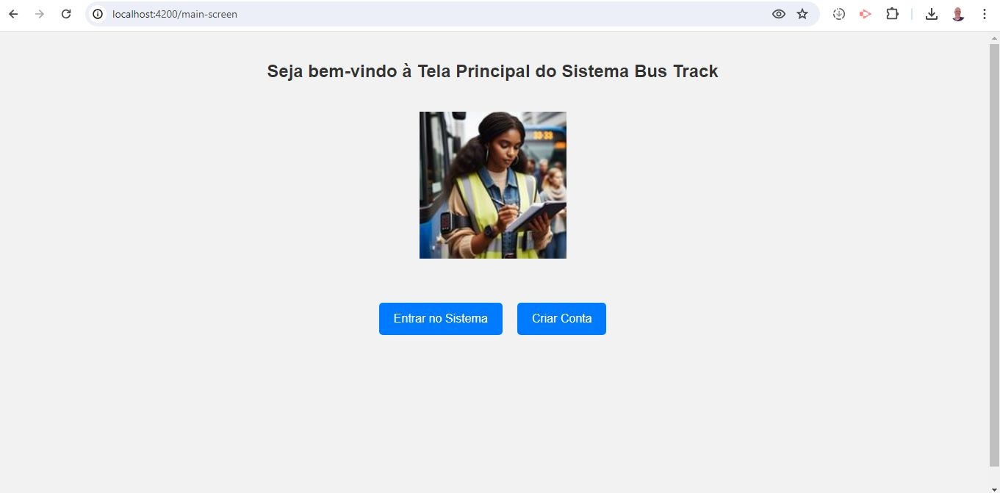
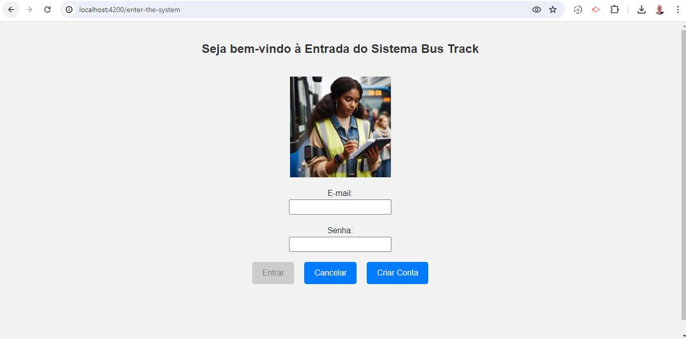
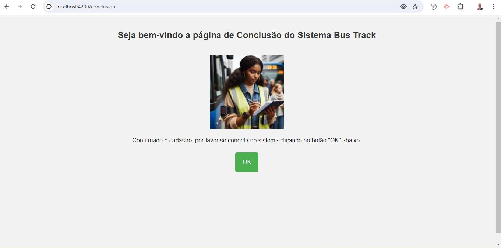

# Telas

Esta documentação apresenta as principais telas do Bus Track e descreve a finalidade de cada uma delas.

## Tela principal

A tela principal é a porta de entrada da aplicação. A partir dela, o usuário pode acessar as opções disponíveis para iniciar sua utilização do sistema.

## Tela de login

A tela de login permite que o usuário informe suas credenciais para acessar o sistema.

## Tela de criação de conta

A tela de criação de conta permite o cadastramento de um novo usuário no sistema.

## Tela de atualização de senha

A tela de atualização de senha permite que o usuário altere sua senha de acesso de acordo com as regras definidas pela aplicação.

## Tela de confirmação

A tela de confirmação apresenta uma etapa intermediária do fluxo de criação ou atualização das informações do usuário.

## Tela de conclusão

A tela de conclusão informa ao usuário que o fluxo iniciado anteriormente foi finalizado.

## Dashboard

O dashboard é a área principal após a autenticação do usuário. Ele apresenta a navegação para os diferentes módulos e funcionalidades disponíveis no sistema.

